# Steps for Windows

1. Create an [AWS](https://aws.amazon.com/) account

2. Click Services tab at the top top open a modal. Under the compute option, choose EC2.

3. Click `Launch Instances` at the top.

4. Filter by `Free tier only` option on the left then choose `Ubuntu Server 20.04 etc...`. Stick to the `64-bit (x86)` architecture.

   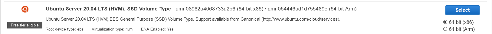

5. There's only 1 free tier, so choose that.

6. Click `Review and Launch`

7. Click `Launch`

8. On the top drop down, choose `Create a new key pair`. This how the we'll ssh into our server. Give it a name that makes sense. My default is usually `{WHAT THIS IS} {TODAY'S DATE}`. So this would be `ubuntuDev 5-1-21` or something similar. Then `Download Key Pair`.

9. You'll want to save this file in a sensical place. I'm not 100% certain, but I believe there _could_ be an `.ssh` directory that you can use already setup. The path for me is `C:\Users\Owner\.ssh`. Owner is the name of my computer for some reason (**shrug**). Yours might be `C:\Users\SeahReidsMillFalc\.ssh`

10. Back at AWS, click `Launch Instances`. This takes a few moments, so lets get configuring.

11. I'm going to be following part of [this guide](https://docs.microsoft.com/en-us/windows-server/administration/openssh/openssh_install_firstuse). Feel free to read at your own leisure.

    ```text
    Both OpenSSH components can be installed using Windows Settings. OpenSSH Server is installed on Windows Server and OpenSSH Client is installed on Windows 10 devices.

    To install the OpenSSH components:

    Open Settings, select Apps > Apps & Features, then select Optional Features.

    Scan the list to see if the OpenSSH is already installed. If not, at the top of the page, select Add a feature, then:
    On Windows 10, find OpenSSH Client, then click Install
    On Windows Server 2019, find OpenSSH Server, then click Install

    Once setup completes, return to Apps > Apps & Features and Optional Features and you should see OpenSSH listed.

    ```

    ```text
    Install OpenSSH using PowerShell

    To install OpenSSH using PowerShell, run PowerShell as an Administrator. To make sure that OpenSSH is available, run the following cmdlet:
    PowerShell

    Get-WindowsCapability -Online | ? Name -like 'OpenSSH*'

    This should return the following output:

    Name  : OpenSSH.Client~~~~0.0.1.0
    State : NotPresent
    Name  : OpenSSH.Server~~~~0.0.1.0
    State : NotPresent

    Then, install the server or client components as needed:
    PowerShell

    # Install the OpenSSH Client
    Add-WindowsCapability -Online -Name OpenSSH.Client~~~~0.0.1.0

    # Install the OpenSSH Server
    Add-WindowsCapability -Online -Name OpenSSH.Server~~~~0.0.1.0

    Both of these should return the following output:

    Path          :
    Online        : True
    RestartNeeded : False
    ```

    That should be all you need in Windows. If you run into problems, follow the [Debug Process](https://docs.google.com/document/d/1Hb3IZVcnrZQ6FXNgiqUBbqrEkRv-k1O_TFffqj3KoVs/edit) to attemp to find a fix.

12. Doing this should have allowed your EC2 to be setup, so let's context switch back to that. Get back to your AWS Dashboard and give your instance a name to help keep track of it. For simplicity sake I named it after my pemfile. Then click the check box to the left of your name field. This will open a sub dashboard underneath the instances. Click on the `Security` tab. Then click on the `Security groups` link.
    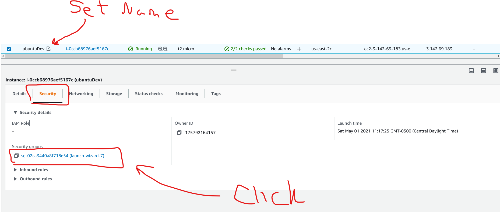

13. At the bottom, click the `Inbound rules` tab, if it isn't already chosen, then click `Edit inbound rules`.
14. Make sure your rules only look like the image below. This should be okay for classroom purposes.
    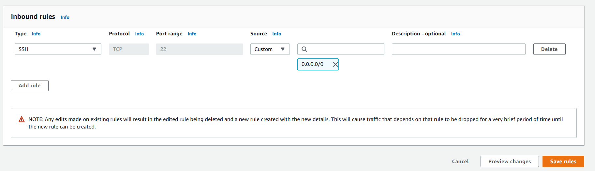

15. Once more, head back to your `Instances` page, check the box of your new instance, and click the `Connect` button near the top of the screen.

16. Click on the `SSH client` tab and stay on this screen. We're going to configure finish this up in
    [VSCode](https://code.visualstudio.com/download) **(😈 Which you have, _RIGHT_?!?!?!? 😈)**

17. Remember that `.pem` file you created for your key? Well find it in your windows directory, right click on it and click `Open with Code`.
    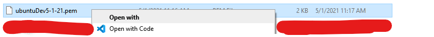

    When you're inside the vscode program, it should have opened a tab with the `.pem` information. Open a terminal with `Ctrl + ~`.
    Alternatively, use the top menu and `Terminal >> New Terminal`. In your CLI, you'll run this command to give the file read,write, and execute permissions. Just change the file name to match your file. Use the tab auto complete to ensure you get the right file.

    ```bash
    chmod 700 ubuntuDev5-1-21.pem
    ```

18. Install the [Remote Development](https://marketplace.visualstudio.com/items?itemName=ms-vscode-remote.vscode-remote-extensionpack) extension pack. Find the `Remote Explorer` menu on the left menu in Vscode and click it. There will be a drop down at the top; choose the `SSH Targets` option. Then click the `➕` key.
    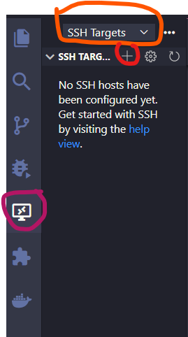

19. An drop down should open at the top saying `Enter SSH Connection Command`. Go back to your AWS `Connect to instance` page and hit the `copy` button under the `Example:` text. It's a long bit of code. Please ensure that it actually spelled your pem file correctly. Mine was not accurate for some reason.
    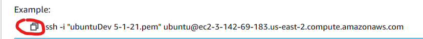

    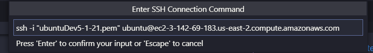

    Then choose your select your configuration file path. It should be the one you set in step 9. 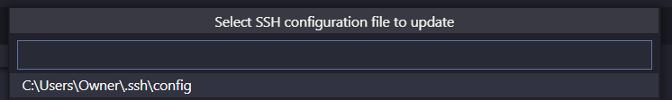

    A little modal opens to the bottom left of your IDE letting you know that you're `Host` has been added. Click the little `Open Config` button.
    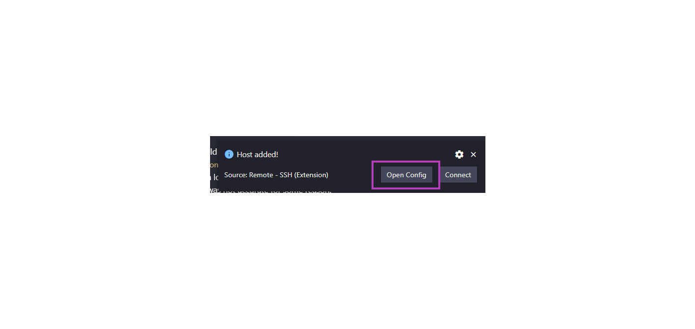

20. When you open the file, you're going to make sure it is accurate. I found that I need to add the path to me `.pem` filed to get this to work.I also changed my `Host` field to make it more user readable.
    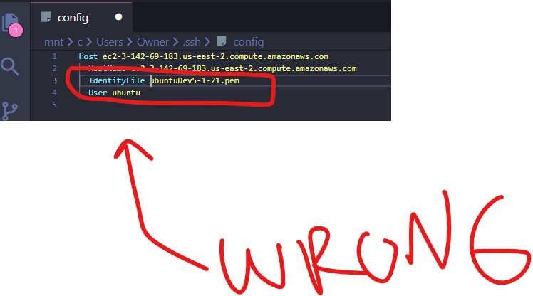

    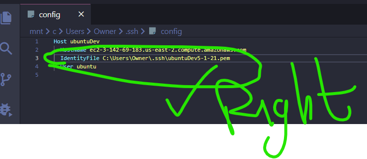

21. Click on the file icon `📂` to connect to your host server. A new instance of `vsCode` will open with 3 operating systems to choose from. Pick `Linux`. It should take just a moment, and you'll see your bottom left corner of `vsCode` change to show your SSH connection is completed.
    

22. Congratulations! Refer to the [WSL Setup](https://github.com/rsamhollyer/WSL_setup) repo to setting up a new Linux environment.
